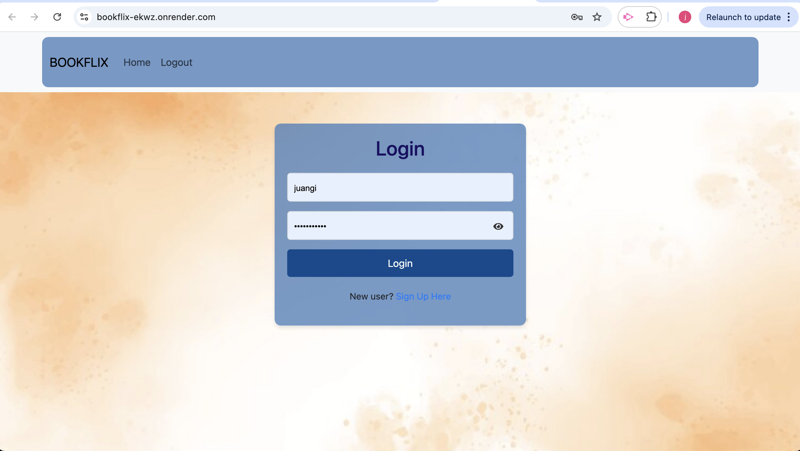
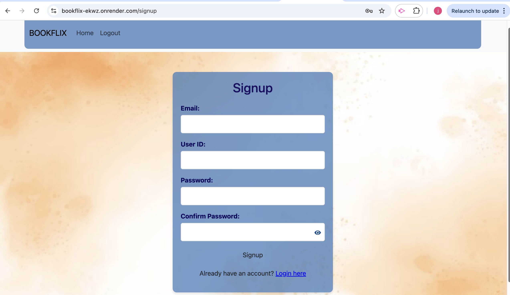

# Bookflix

Bookflix is a professional web application that allows users to search for books and movies. It features a login page where users must sign in before accessing the search functionality. With a clean user interface and modern API integration, Bookflix provides an efficient way to find the content you're looking for.

---

## Table of Contents
- [Description](#description)
- [Features](#features)
- [APIs Used](#apis-used)
- [Installation](#installation)
- [Usage](#usage)
- [Technologies Used](#technologies-used)
- [Contributing](#contributing)
- [License](#license)

---

## Description

Bookflix is a single-page application that combines the functionality of searching for books and movies under one platform. Users can log in to their accounts to access search features, leveraging separate APIs for books and movies to deliver accurate and relevant results.

---

## Features

- **Secure Login**: Users must authenticate to access the application.
- **Book Search**: Search for books using the integrated Books API.
- **Movie Search**: Search for movies using the integrated Movies API.
- **Seamless Navigation**: Transition between book and movie search pages without reloading.
- **Responsive Design**: Optimized for both desktop and mobile devices.

---

## APIs Used

### Google Books API
The Google Books API is used to fetch book data, including titles, authors, and descriptions. Results are displayed in a user-friendly format, with links to additional details where available.

- **Endpoint Example**: `https://www.googleapis.com/books/v1/volumes?q={query}`
- **Documentation**: [Google Books API Documentation](https://developers.google.com/books)

### OMDb API
The OMDb API is used to retrieve movie details, including titles, release years, and posters. This API ensures that users can search for a wide variety of movies quickly.

- **Endpoint Example**: `http://www.omdbapi.com/?apikey={API_KEY}&s={query}`
- **Documentation**: [OMDb API Documentation](http://www.omdbapi.com/)

---

## Installation

1. **Clone the repository** to your local machine:

   ```bash
   git clone https://github.com/your-username/Bookflix.git
    ```

2. **Navigate** to the project directory:

    ```bash
    cd Bookflix
    ```

3. **Install** the necessary dependencies:

     ```bash
     npm install
    ```

4. Set up **environment variables** by creating a **.env** file in the **root directory**:


**.env example**:
```bash
DB_NAME=entrainment_library
DB_USER=XXXXX
DB_PASSWORD=XXXXX
GOOGLE_BOOKS_API_KEY=XXXXX
JWT_SECRET_KEY=XXXXX
```

5.	**Start the development server**:

 ```bash
 git npm start
 ```

---
     
## Usage

1. Open the application in your browser after starting the development server.
2. Sign in or create an account on the login page.
   -  
   -  

3. After authentication, navigate to the search page.
   -  

4. Choose to search for either books or movies and enter a query.
   - 

   - 

5. View results.
   -  

---

## Technologies Used

### Core Technologies:
- **React.js**: For building the front-end user interface.
- **Node.js**: Backend environment for server-side functionality.
- **React-Bootstrap**: Used for styling and responsive components.
- **React Router**: For navigation between pages.

### Dependencies:
- **@fortawesome/fontawesome-svg-core**: `^6.6.0`
- **@fortawesome/free-solid-svg-icons**: `^6.6.0`
- **@fortawesome/react-fontawesome**: `^0.2.2`
- **react-bootstrap**: `^2.10.5`
- **react-router-dom**: `^6.28.0`

### DevDependencies:
- **@types/node**: `^22.9.0`
- **concurrently**: `^8.2.2`
- **nodemon**: `^3.1.3`
- **wait-on**: `^7.2.0`

---

## Contributing

Juan Girelli
Shirisha Korukonda Bhattaru
Camden Cox
Tabari Latimore


Contributions are welcome! Please follow these steps to contribute:

1. Fork the repository.
2. Create a new branch for your feature or bug fix:
    ```bash
    git checkout -b feature-name
    ```
3. Make your changes and commit them:
    ```bash
    git commit -m 'Add some feature'
    ```
4. Push to the branch:
    ```bash
    git push origin feature-name
    ```
5. Open a pull request to the main branch.

---
## License

MIT license
